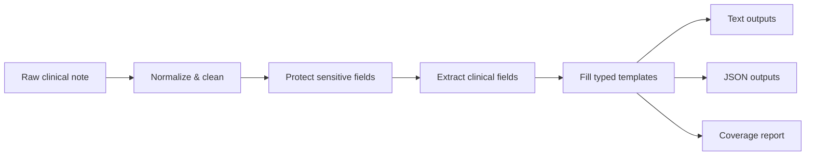
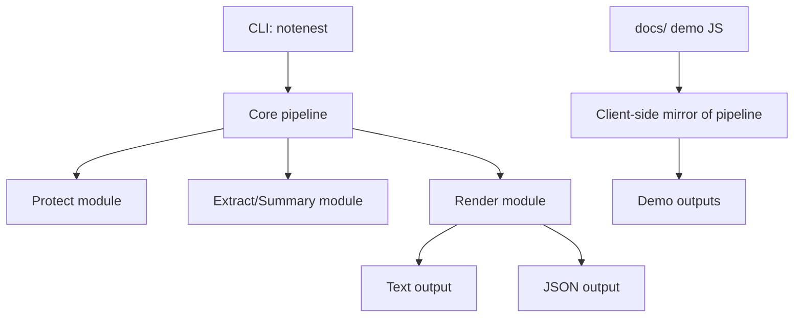

# NoteNest — Clinical Note Prep Toolkit

Website: https://princey9.github.io/NoteNest/

Demo: https://princey9.github.io/NoteNest/demo/

Pricing: https://princey9.github.io/NoteNest/pricing/

Repo: https://github.com/Princey9/NoteNest

Releases: https://github.com/Princey9/NoteNest/releases/latest

NoteNest is a clinical note prep toolkit that works offline to protect sensitive details with placeholders and produce usable summaries. It converts messy notes into a patient-friendly view and clinician-ready structured outputs (SOAP or 5C’s), and it includes Cloak Mode for scan/protect/report workflows.

---

## Why it matters (value)
- **Protects sensitive details** (names, emails, phones, IDs, DOB, addresses) using placeholders.
- **Clinician-ready** outputs: SOAP or 5C’s, selectable.
- **Patient-ready** output: complaint-first, clear, and actionable.
- **Offline-first**: no network calls, no paid APIs.
- **Exam-ready**: reproducible checks, static GitHub Pages demo, and release workflow.

---

## Quickstart

### CLI (from repo root)
```bash
cargo run --quiet -- convert - --clinician soap --style protected --format text <<'NOTE'
ER note (messy): JOHN O?? 43M chest tightness x2d, worse stairs + SOB. wife Mary 0176-12345678 called.
email john.osmith@gmail.com MRN 883920 DOB 12/03/1982 addr 12 Hauptstrasse 80331 Muenchen.
pmh HTN/DM2; meds metformin 500 bid + ramipril 5mg od; nkda.
vitals BP168/96 HR108 T37.2. ecg ?st-depr. trop 0.08 ng/mL.
plan: send ED; repeat trop 3h; ASA; consider heparin; f/u cardio.
NOTE
```

### Demo site (local)
```bash
python3 -m http.server 8001 --directory docs
```
Open http://localhost:8001/

---

## How it works (offline pipeline)



- **Normalize**: whitespace cleanup, bullet normalization, junk trimming.
- **Protect**: deterministic placeholder replacement.
- **Extract**: heuristic detection (symptoms, duration, meds, vitals, tests, plan, etc.).
- **Render**: outputs are generated from typed structures only.

---

## Architecture overview



---

## Features
- **Patient View** (complaint-first, plain language, actionable).
- **Clinician View** (SOAP or 5C’s toggle).
- **Protected placeholders** (Protected/Masked/Hidden/Removed/<TAG> styles).
- **Coverage report** (fields found/missing + protected counts).
- **Cloak Mode**: scan/protect/report for safer sharing.

---

## Privacy (Protected language only)
- NoteNest replaces sensitive fields with placeholders like `[EMAIL_PROTECTED]`.
- Runs locally only. **No network calls**.
- Designed for safe sharing and auditability.

---

## Clinician formats
- **SOAP**: S (Subjective), O (Objective), A (Assessment), P (Plan).
- **5C’s**: Chief complaint, Course, Context, Concerns, Coping.
- Toggle with `--clinician soap` or `--clinician 5cs`.

---

## Cloak Mode (ClinCloak integration)
Commands are available under `notenest cloak`:
- `scan` — PHI scan summary by type (counts only).
- `protect` — generate protected outputs + JSON/CSV/MD reports.
- `config init` / `config validate` — YAML config scaffold and checks.
- `report` — export run summary.
- `git-hook install` — optional hook that runs scan before commit.

Examples:
```bash
cargo run --quiet -- cloak scan ./sample_notes
cargo run --quiet -- cloak protect ./sample_notes -o ./out_cloak
cargo run --quiet -- cloak config init -o notenest-cloak.yml
cargo run --quiet -- cloak report ./out_cloak --format csv
cargo run --quiet -- cloak git-hook install --mode pre-commit --paths "*.txt"
```

---

## CLI usage (current commands)

### Convert
```bash
notenest convert <input|-> \
  [--clinician soap|5cs] \
  [--format text|json|both] \
  [--out <dir>] \
  [--placeholder-style protected|masked|hidden|removed|angle] \
  [--patient] [--redact] [--all] [--offline]
```

### Batch
```bash
notenest batch <input_dir> [--glob "*.txt"] [--out <dir>] [--all] [--offline]
```

### Self-check
```bash
notenest self-check
```

### Cloak
```bash
notenest cloak scan <path> [--config <yaml>] [--csv <file> --col <name>...]
notenest cloak protect <path> -o <out_dir> [--config <yaml>] [--mapping <file>] [--mapping-pass <env:...>] [--format text|json|both] [--emit-structured]
notenest cloak config init [-o <path>]
notenest cloak config validate [--path <yaml>]
notenest cloak report <run_dir_or_run_id> [--out <dir>] [--format csv|json|md]
notenest cloak git-hook install [--mode pre-commit] [--config <yaml>] [--paths <glob>...]
```

---

## Output structure (headings)

Patient View headings (always in order):
- What you came in with
- What it could mean
- What we found in your note
- What to do next (checklist)
- Questions to ask your clinician
- When to seek urgent care
- Disclaimer

Clinician View:
- SOAP (S/O/A/P) **or** 5C’s (Chief complaint / Course / Context / Concerns / Coping)

Coverage summary:
- fields_found, missing, protected_counts

---

## Data example (messy input)

```text
ER note (messy): JOHN O?? 43M chest tightness x2d, worse stairs + SOB. wife Mary 0176-12345678 called.
email john.osmith@gmail.com MRN 883920 DOB 12/03/1982 addr 12 Hauptstrasse 80331 Muenchen.
pmh HTN/DM2; meds metformin 500 bid + ramipril 5mg od; nkda.
vitals BP168/96 HR108 T37.2. ecg ?st-depr. trop 0.08 ng/mL.
plan: send ED; repeat trop 3h; ASA; consider heparin; f/u cardio.
```

Expected output structure (headings only):
- Placeholder style
- Protected note
- Patient View
- Clinician View
- Coverage summary

---

## Installation / downloads

From Releases (latest): https://github.com/Princey9/NoteNest/releases/latest

Linux aarch64 (required):
```bash
curl -L -o notenest-aarch64.tar.gz \
  https://github.com/Princey9/NoteNest/releases/latest/download/aarch64-unknown-linux-musl.tar.gz
tar -xzf notenest-aarch64.tar.gz
./notenest --help
```

Linux x86_64 (bonus):
```bash
curl -L -o notenest-x86_64.tar.gz \
  https://github.com/Princey9/NoteNest/releases/latest/download/x86_64-unknown-linux-musl.tar.gz
tar -xzf notenest-x86_64.tar.gz
./notenest --help
```

---

## Demo website usage
- Visit the live demo: https://princey9.github.io/NoteNest/demo/
- Choose a mode: Summarize or Cloak.
- Select placeholder style and clinician format.
- Paste a messy note or choose a sample.
- Use Copy/Download buttons for outputs.

---

## Project structure

Rust core:
- `src/lib.rs` — public API exports
- `src/main.rs` — thin CLI entry
- `src/cli.rs` — clap definitions
- `src/notenest/` — pipeline (protect, extract, render, types)
- `src/cloak/` — ClinCloak scan/protect/report engine
- `src/util/` — FS helpers

Static site:
- `docs/index.html`
- `docs/pricing/index.html`
- `docs/demo/index.html`
- `docs/assets/app.js`
- `docs/assets/styles.css`

Fixtures:
- `fixtures/templates/*.schema.json`
- `fixtures/examples/*.example.json`

---

## Tests and acceptance checks

Acceptance tests (run from repo root):
```bash
cargo fmt --check
cargo clippy -- -D warnings
cargo test
scripts/check_pages.sh
```

CLI sanity example:
```bash
echo "Pt here w chest pain x2d tel +49..." | cargo run --quiet -- convert - --clinician soap --style protected --format text
```

---

## GitHub Pages setup
Settings → Pages → Source: **main** branch, **/docs** folder.

---

## Release workflow
Tagging a version triggers the GitHub Actions workflow at `.github/workflows/main.yml` to build and publish binaries. Download links on the site point to `Releases/latest`.

Tag example:
```bash
git tag v0.2.0
git push origin v0.2.0
```

---

## Exam submission checklist
- GitHub repo: https://github.com/Princey9/NoteNest
- GitHub Pages: https://princey9.github.io/NoteNest/
- Files: `Cargo.toml`, `src/main.rs`, `src/lib.rs` (optional)
- Linux aarch64 binary: from https://github.com/Princey9/NoteNest/releases/latest
- Optional extra binaries (x86_64)
- Workflow file: `.github/workflows/main.yml`

---

## Troubleshooting
- **Cargo.toml not found**: run commands from repo root.
- **Port already in use**: pick another port, e.g. `python3 -m http.server 8002 --directory docs`.
- **zsh comments**: remove trailing `# ...` if pasting into shell.
- **GitHub Pages caching**: hard refresh or wait a few minutes after pushing.

---

## About section suggestion (GitHub)
NoteNest — offline clinical note prep toolkit with protected placeholders, patient view, clinician SOAP/5C’s, and Cloak Mode scans. Live demo: https://princey9.github.io/NoteNest/

## Business
- Lean Canvas: business/LEAN_CANVAS.md
- Pitch one-pager: business/PITCH_ONE_PAGER.md
