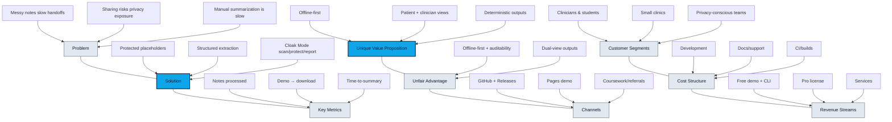

# NoteNest Lean Canvas

**Tagline:** Protect sensitive clinical notes and generate patient + clinician summaries, offline.

Links: GitHub Repo: https://github.com/Princey9/NoteNest | Live Site: https://princey9.github.io/NoteNest/ | Demo: https://princey9.github.io/NoteNest/demo/

---

## How to view diagrams
- GitHub renders Mermaid automatically in Markdown.
- In VS Code: open the Markdown Preview (View → Command Palette → “Markdown: Open Preview”).
- If Mermaid doesn’t render in VS Code, install the extension “Markdown Preview Mermaid Support”.

## Diagram: Lean Canvas map


## Problem (Top 3)
1) Messy clinical notes are hard to understand, slowing care and handoffs.
2) Sharing notes risks exposing sensitive data and violates privacy rules.
3) Manual summarization and de-identification are time-consuming and error-prone.

## Customer Segments
- **Primary:** Students and clinicians preparing notes for handoffs, referrals, or second opinions.
- **Secondary:** Clinics and small practices needing fast, offline prep of notes.
- **Early adopters:** Health tech students, clinical researchers, and privacy-conscious providers.

## Unique Value Proposition
**Offline-first clinical note prep** that protects sensitive fields with placeholders and produces structured patient and clinician views in seconds.

## Solution
- Protect sensitive details using deterministic placeholder rules.
- Extract clinical fields and render patient-friendly + clinician-structured views.
- Cloak Mode for scan/protect/report to enable safe sharing workflows.

## Channels
- GitHub repo + Releases
- GitHub Pages demo site
- Coursework submissions and referrals

## Revenue Streams
- Free: demo + local CLI
- Pro: individual license (offline workflows + templates)
- Services: clinic onboarding, customization, and training

## Cost Structure
- Development time
- Documentation and support
- Distribution (CI/builds)

## Key Metrics
- Notes processed per user
- Conversion rate from demo to CLI downloads
- Reduced time-to-summary (baseline vs NoteNest)
- Protected field detection counts per note

## Unfair Advantage
- Offline-first design with deterministic, auditable placeholders
- Dual-view output (patient + clinician) in one run
- Static demo that mirrors core logic for trust and transparency

---

## Diagram: Customer journey / product flow
```mermaid
flowchart LR
  A[Input messy note] --> B[Choose mode]
  B --> S1[Summarize & structure]
  B --> C1[Cloak Mode]
  S1 --> S2[Protect placeholders]
  S2 --> S3[Extract fields]
  S3 --> S4[Render Patient + Clinician View (SOAP/5C’s)]
  S4 --> Z[Export/share (offline)]

  C1 --> C2[Protect placeholders]
  C2 --> C3[Cloak scan summary]
  C3 --> C4[Cloak report (JSON/CSV)]
  C4 --> Z

  N[Offline-only. No network calls.]:::note
  Z --- N

  classDef focus fill:#22d3ee,stroke:#0f172a,stroke-width:2px,color:#0f172a;
  class S1,S2,C1,C2 focus;
  classDef note fill:#f1f5f9,stroke:#64748b,stroke-width:1px,color:#0f172a;
```
