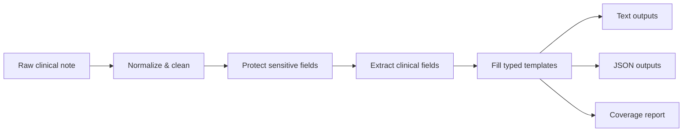
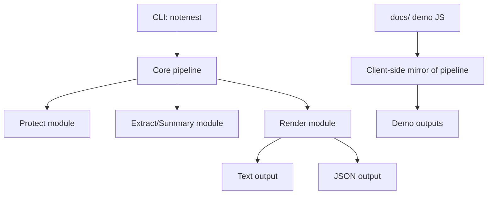
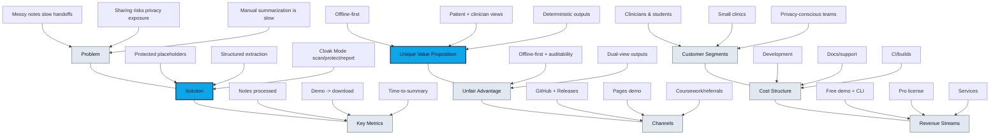
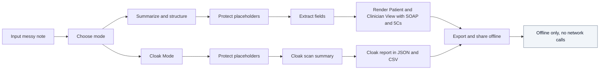

# NoteNest Diagrams (Mermaid)

## How to view diagrams
- GitHub renders Mermaid automatically in Markdown.
- For local previews in VS Code, install a Mermaid extension (e.g., “Markdown Preview Mermaid Support”).
- Alternatively, use GitHub.dev (press `.` in the repo) or paste the diagram code into https://mermaid.live.

Verification checklist:
- Open README on GitHub and confirm diagrams render.
- Open VS Code preview and confirm diagrams render (with extension installed).
- If not, paste Mermaid code into mermaid.live.

---

## Offline pipeline (README)

## Architecture overview (README)

---

## Lean Canvas map (business/LEAN_CANVAS.md)

## Customer journey / product flow (business/LEAN_CANVAS.md)

Troubleshooting Mermaid: GitHub renders Mermaid automatically. For local previews in VS Code, install a Mermaid preview extension.
